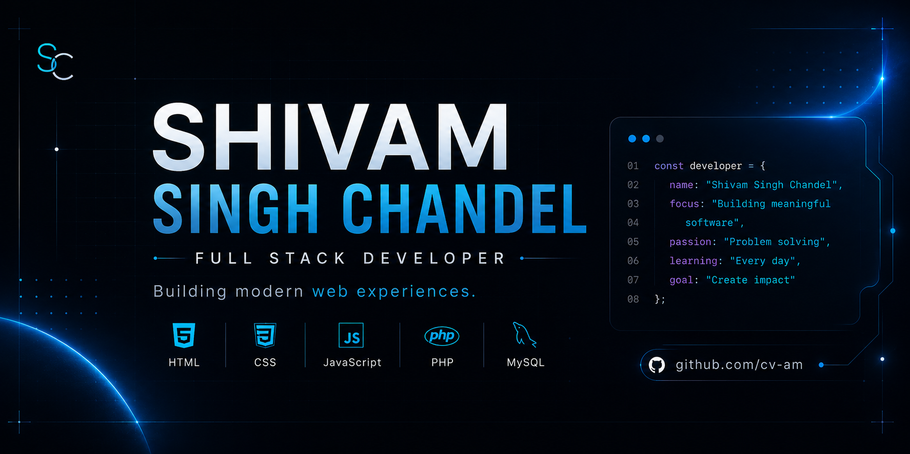

# Hey 👋 I'm Shivam Singh Chandel

### Full Stack Developer • BCA Student • Building Modern Web Applications

---

# 💫 About Me

I'm **Shivam Singh Chandel**, a BCA student passionate about building modern, responsive, and user-friendly web applications.

I enjoy turning ideas into real projects, improving my problem-solving skills, and learning technologies that help me become a better developer every day.

Currently I'm focused on creating projects that strengthen both my frontend and backend development skills.

---

## 🚀 Current Focus

* 🤝 Building **SkillSwap**
* 🌐 Improving my Developer Portfolio
* ⚙️ Learning Backend Development with PHP & MySQL
* 📚 Mastering JavaScript
* 🌱 Writing cleaner and more scalable code

---

# 🛠 Tech Stack

### Languages

### Tools

---

# 🚀 Featured Projects

| Project                   | Description                                                              |
| ------------------------- | ------------------------------------------------------------------------ |
| 🌐 **Portfolio**          | A modern responsive portfolio showcasing my work and developer journey.  |
| 🤝 **SkillSwap**          | A platform where users can share, learn, and collaborate through skills. |
| 📚 **JavaScript Journey** | My learning repository covering JavaScript concepts and mini projects.   |
| 🗄️ **MySQL Practice**    | SQL queries, joins, normalization, and database exercises.               |

---

# 📊 GitHub Analytics

  

---

# 📈 Contribution Activity

---

# 🌐 Connect With Me

🌐 **Portfolio**
https://cvam-v2.vercel.app/

📧 **Email**
[shivamsinghchandel.work@gmail.com](mailto:shivamsinghchandel.work@gmail.com)

💼 **LinkedIn**
https://linkedin.com/in/cvam2006

---

## 💭 Philosophy

> **"Every project is an opportunity to learn, improve, and build something meaningful."**

Thank you for visiting my profile.

⭐ If you like my work, feel free to explore my repositories and leave a star.

